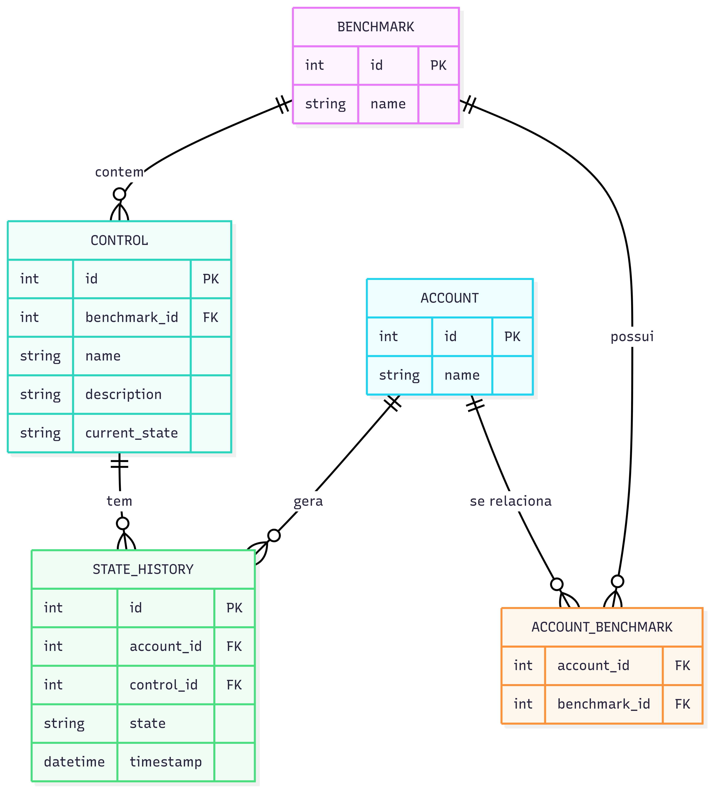

# Respostas da primeira questão

## Diagrama MER

## Q1: Listar Benchmark com Controles e Estado Atual para uma Account

Índices:

    STATE_HISTORY(account_id, control_id, timestamp DESC)
    Permite buscar eficientemente o último estado de cada controle para uma account específica. 
    A ordenação DESC por timestamp garante que o registro mais recente seja o primeiro resultado.

    ACCOUNT_BENCHMARK(account_id, benchmark_id)
    Acelera a identificação de quais benchmarks estão associados à account em questão, 
    facilitando a junção entre as entidades Account e Benchmark.

    CONTROL(benchmark_id) INCLUDE (name, description)
    Otimiza a recuperação de todos os controles de um benchmark específico, incluindo as 
    colunas frequentemente acessadas (name e description).

    (Opcional) CURRENT_STATE(account_id, control_id)
    Caso exista tabela de estado atual materializada, elimina a necessidade de acessar STATE_HISTORY.

## Q2: Listar Benchmark com Controles e Mudanças de Estado em um Intervalo para uma Account

Índices:

    STATE_HISTORY(account_id, timestamp, control_id)
    Para consultas de intervalo temporal, permitindo filtrar eficientemente todos 
    os eventos de mudança de estado para uma account específica dentro de uma janela temporal.

## Q3: Obter Benchmark com Controles e Estado em uma Data/Hora Específica para uma Account

Índices:

    STATE_HISTORY(account_id, control_id, timestamp DESC)
    Fundamental para encontrar o estado válido em um momento específico. 
    A ordenação DESC por timestamp permite localizar rapidamente o último registro ≤ X.

    (Opcional) STATE_HISTORY(timestamp, account_id) INCLUDE (control_id, state)
    Indicado para casos em que se conhece exatamente o timestamp do evento, 
    permitindo busca direta extremamente rápida.

